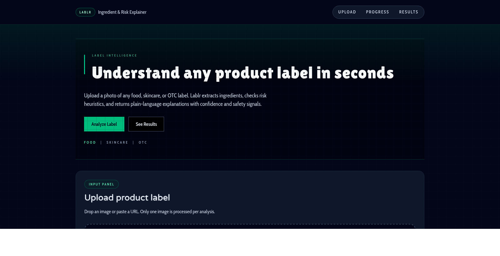

<h1 align="center">Lablr</h1>

<p align="center">
  
</p>

<p align="center">
  
  
  
  
  
  
  
</p>

## Overview
Lablr turns dense product labels into plain-language ingredient and risk insights in seconds.

Built for everyday consumers, Lablr helps you move from **"What does this label even say?"** to **"I know what this ingredient does and how risky it might be."**

Upload a label photo (or provide an image URL), let OCR extract the raw text, and get structured explanations with risk hints, confidence signals, and source references.

Whether you are scanning skincare, food, or OTC packaging, Lablr is designed to make label intelligence fast, transparent, and practical.

## Features
- OCR with OCR.space (no Mastra pipeline, no Docker/Nosana dependencies).
- Ingredient, warning, and claim extraction with domain guessing.
- Language detection for localized explanation output.
- Optional external lookups (OpenFoodFacts/OpenBeautyFacts) to enrich explanations.
- Clean Next.js App Router UI with upload, progress steps, and results table.

## Architecture
- `agent/ocr.ts`: Calls OCR.space and normalizes OCR output into `OCRResult`.
- `agent/explain.ts`: Builds user-friendly ingredient explanations using local glossary + optional external lookups.
- `src/app/api/analyze/route.ts`: Main API endpoint for upload/URL analysis.
- `src/app/page.tsx`: UI flow and rendering.
- `mcp/file-server/*`: Local glossary and risk rules.

## Environment
Create `.env.local` (or `.env`) with:

```bash
OCR_SPACE_API_KEY="helloworld-or-your-key"
# OCR_SPACE_API_BASE="https://api.ocr.space/parse/image"
# OCR_SPACE_ENGINE="2"
# OCR_SPACE_LANGUAGE="auto"
# OCR_UPLOAD_MAX_MB="10"

# Optional OCR fallback (used if OCR.Space fails)
# OPTIIC_API_KEY="your-optiic-api-key"
# OPTIIC_API_BASE="https://api.optiic.dev/process"
# OPTIIC_DOWNLOAD_MAX_MB="5"

# For explanation stage (Gemini)
GEMINI_API_KEY="your-gemini-api-key"
# GEMINI_API_BASE="https://generativelanguage.googleapis.com/v1beta"
# GEMINI_MODEL="gemini-2.5-flash"
# GEMINI_FALLBACK_MODEL="gemini-2.0-flash"

# Optional external enrichment
# WEB_FETCH_ENABLED="true"
# OFF_FETCH_LIMIT="3"
```

## Scripts
- `pnpm dev` — run Next.js dev server.
- `pnpm build` — production build.
- `pnpm start` — run production server.
- `pnpm lint` — lint project.
- `pnpm testsprite:mcp:setup` — generate local `.mcp.json` using `TESTSPRITE_API_KEY`.
- `pnpm testsprite:mcp:verify` — verify TestSprite MCP package is reachable.

## TestSprite MCP
- For credit-tracked cloud runs, set `TESTSPRITE_API_KEY` and run `pnpm testsprite:mcp:setup`.
- The setup script updates `.mcp.json` and preserves existing MCP servers.
- Cloud run inputs live in `testsprite_tests/standard_prd.json` and `testsprite_tests/testsprite_frontend_test_plan.json`.
- Legacy local JS suite (`testsprite_tests/run_testsuite.mjs` + `TC*.mjs`) has been removed and is no longer used.

## Flow
1. Upload image or send `image_url` to `POST /api/analyze`.
2. OCR route extracts text via OCR.space.
3. Parser normalizes OCR into domain, ingredients, warnings, claims, and language.
4. Explanation route enriches and returns readable summaries.

## License
MIT. See `LICENSE`.
